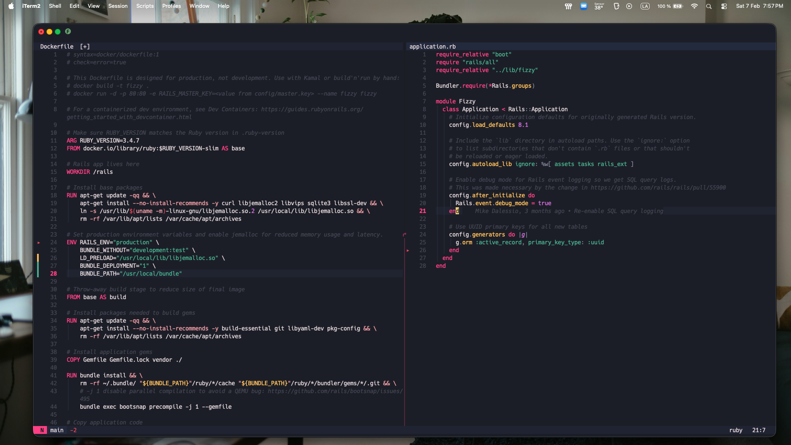

# amaranth.nvim

A vivid, pink-accented dark colorscheme for Neovim. Inspired by [VSCode PinkCatBoo](https://github.com/ftsamoyed/PinkCatBoo).



## Requirements

- Neovim >= 0.8.0
- `termguicolors` enabled

## Installation

### [lazy.nvim](https://github.com/folke/lazy.nvim)

```lua
{
  "kshinya7/amaranth.nvim",
  lazy = false,
  priority = 1000,
  config = function()
    vim.cmd.colorscheme("amaranth")
  end,
}
```

### [packer.nvim](https://github.com/wbthomason/packer.nvim)

```lua
use {
  "kshinya7/amaranth.nvim",
  config = function()
    vim.cmd.colorscheme("amaranth")
  end,
}
```

## Configuration

Amaranth works out of the box, but you can customize it:

```lua
require("amaranth").setup({
  transparent = false,  -- Enable transparent background
  italics = {
    comments = true,    -- Italic comments
  },
  overrides = {},       -- Override specific highlight groups
})

vim.cmd.colorscheme("amaranth")
```

### Custom highlight overrides

```lua
require("amaranth").setup({
  overrides = {
    Normal = { bg = "#000000" },
    Comment = { fg = "#888888", italic = false },
  },
})
```

## Supported Plugins

- Treesitter
- LSP semantic tokens
- Neo-tree
- Gitsigns
- Which-key
- Flash.nvim

## License

MIT
